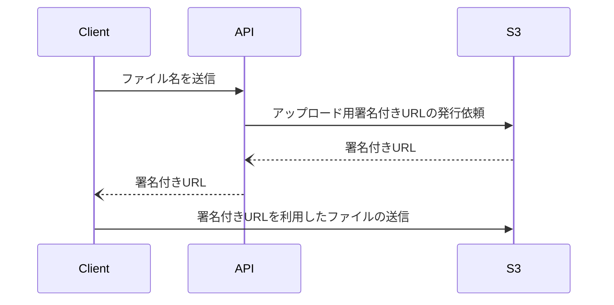
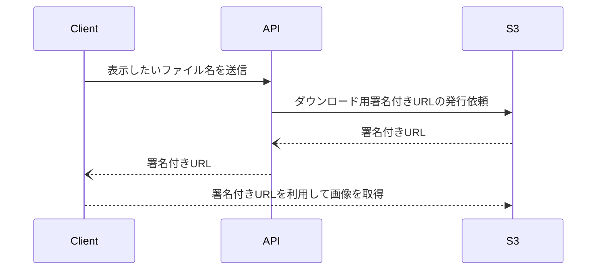
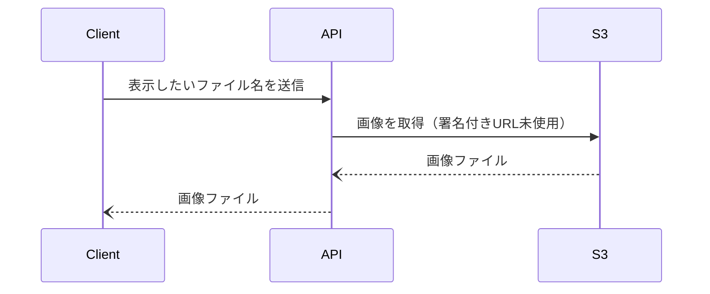

# nextjs-s3-example

## 概要

[Sample Site](https://nextjs-s3-example.vercel.app/)

## はじめに

Next.jsを利用したS3バケットへ署名付きURLを利用してファイルをアップロード、また署名付きURLの取得、API経由でファイルを取得するサンプルになります。

フロントエンドではAWSの認証情報を持たずバックエンドのAPIがAWSとやり取りする形を想定しています。またフロントエンドとバックエンドの間には別途認証・認可が設定されることを前提としています。

今回のサンプルではNext.jsのAPI機能を利用してフロントエンドとバックエンドを擬似的に分離しています。

## 動作イメージ

### 1.アップロード



- `api/upload.ts`
    
    `s3.getPresignedUrl`を利用せず`s3.createPresignedPost`を利用することでファイルサイズの制限を利用することが可能
    

### 2.画像の表示（署名付きURLを利用）



- `api/get.ts`
    
    ファイル名を受け取り署名付きURLを返すAPI。資料PDFなど一定期間ユーザーがダウンロードすることができるような用途での利用が多い。署名付きURLがを取得後再度画像の取得が必要なため手数が多くなる
    

### 3.画像の表示（署名付きURLを利用しない）



- `api/image.ts`
    
    署名付きURLは介せずに画像ファイルを直接返すAPI。フロントエンドで表示する用途としては使いやすく汎用性が高い
    

## Next.jsに必要な設定

Next.jsのAPIがAWSサービスへ直接接続するため環境変数を利用した認証情報が必要になります。フロントエンドでは利用しません。

```bash
# .env.local

ACCESS_KEY=******
SECRET_KEY=******
REGION=ap-northeast-1
BUCKET_NAME=S3バケット名
```

## CORSの設定

S3バケットへJSアプリケーションからファイルを送るには`Cross-Origin Resource Sharing (CORS)`の設定が必要（今回利用しているのは`POST`のみ）

```json
[
    {
        "AllowedHeaders": [
            "*"
        ],
        "AllowedMethods": [
            "PUT",
            "POST",
            "DELETE"
        ],
        "AllowedOrigins": [
            "http://localhost:3000",
            "https://nextjs-s3-example.vercel.app"
        ],
        "ExposeHeaders": []
    }
]
```
